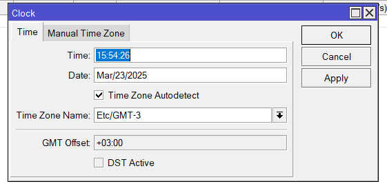
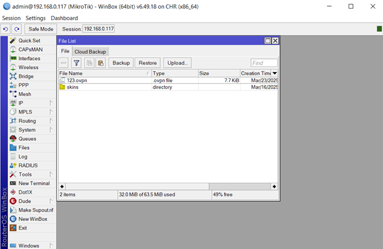
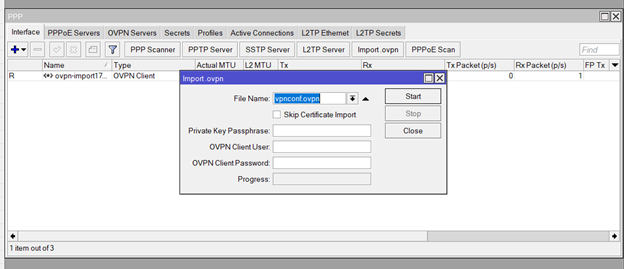
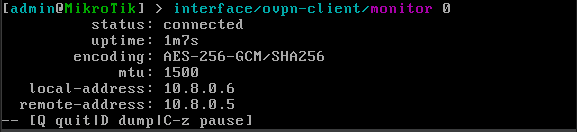
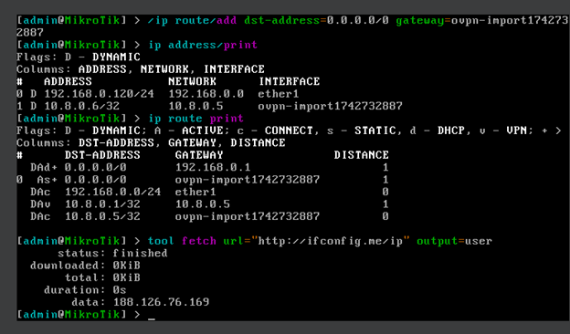

University: [ITMO University](https://itmo.ru/ru/)
Faculty: [FICT](https://fict.itmo.ru)
Course: [Network programming](https://github.com/itmo-ict-faculty/introduction-in-routing)
Year: 2024/2025
Group: K3323
Author: Abdrakhmanov Martin Maratovich
Lab: Lab1
Date of create: 23.03.2025
Date of finished: - 

# Конфигурация mikrotik

Добавим gateway для vpn и с помощью fetch на http://ifconfig.me/ip узнаем под каким ip нас "видит" 

188.126.76.169 - ip сервера на котором стоит vpn, значит все работает!
